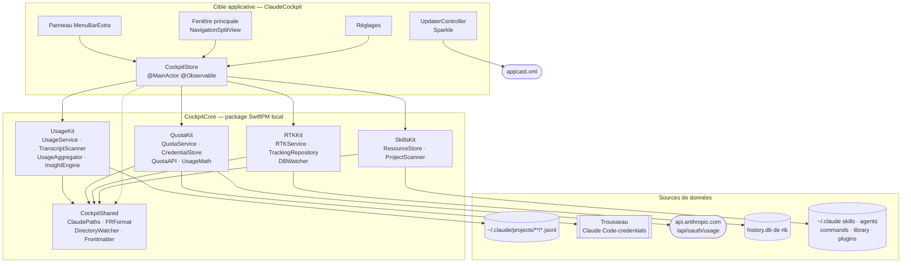

# ARCHITECTURE — Claude Cockpit

Version française de [`ARCHITECTURE_EN.md`](ARCHITECTURE_EN.md), qui reste la source de vérité ;
les deux sont modifiés dans le même tour. Les décisions de conception derrière ces choix sont
dans
[`docs/superpowers/specs/2026-09-21-claude-cockpit-design.md`](docs/superpowers/specs/2026-09-21-claude-cockpit-design.md).

## Vue d'ensemble

Claude Cockpit est une application macOS native (Swift 5.9, SwiftUI sur une coque AppKit,
macOS 14+) qui lit quatre sources indépendantes et les réunit en un seul endroit : les jauges de
quota Anthropic, les transcriptions locales de Claude Code, la base de données d'économies de
rtk, et l'arborescence des skills, agents et commandes.

Le découpage qui gouverne tout le reste est **la logique dans un package, l'interface dans la
cible applicative**. `CockpitCore` est un package SwiftPM local où aucun framework d'interface
n'apparaît : il compile et se teste sans `NSApplication`, ce qui rend `swift test` rapide et
fiable. La cible applicative porte les vues SwiftUI, la coque AppKit, Sparkle, et un unique objet
concentrateur qui détient les services.

Chaque kit expose un **service** — un acteur ou une classe `Sendable` — qui produit une structure
**snapshot** immuable. L'application n'ouvre jamais elle-même un fichier, une socket ou une base
de données. Cette frontière est la raison pour laquelle la panne d'une source ne peut pas en
emporter une autre : le store l'attrape, la range comme un état, et la section concernée affiche
une bannière pendant que le reste continue de fonctionner.

## Diagramme de composants

Une version interactive de ce diagramme (déplacement, zoom, recherche, vues guidées, références de source vérifiées contre le dépôt) est publiée sur [https://vincentlauriat.github.io/ClaudeCockpit/diagrams/claude-cockpit-architecture.html](https://vincentlauriat.github.io/ClaudeCockpit/diagrams/claude-cockpit-architecture.html). Sa source est `docs/diagrams/claude-cockpit.architecture.json`.

## Modules

| Module | Responsabilité | Types clés | Dépend de |
|---|---|---|---|
| `CockpitShared` | Tout ce sur quoi les autres kits doivent s'accorder : où vivent les fichiers, comment s'écrivent les nombres en français, comment surveiller un répertoire, comment lire un front matter | `ClaudePaths`, `FRFormat`, `DirectoryWatcher`, `Frontmatter` | Foundation |
| `UsageKit` | Transforme les transcriptions de Claude Code en tous les chiffres qu'affichent les écrans d'usage | `UsageService`, `TranscriptScanner`, `UsageAggregator`, `UsageSnapshot`, `UsageEvent`, `PricingSettings`, `InsightEngine`, `SessionSummary`, `BreakdownDimension` | `CockpitShared` |
| `QuotaKit` | Lit le jeton OAuth, appelle l'endpoint de jauges d'Anthropic, applique la politique de limitation, projette le rythme | `QuotaService`, `CredentialStore`, `QuotaAPI`, `Meter`, `GaugeSnapshot`, `PaceProjection`, `UsageMath`, `PaceSentence` | `CockpitShared` |
| `RTKKit` | Accès en lecture seule à la base SQLite de rtk, plus un observateur qui se déclenche quand rtk écrit | `RTKService`, `TrackingRepository`, `DBWatcher`, `RTKSnapshot`, `CommandRecord`, `TotalsStat`, `DayStat`, `CommandStat` | `CockpitShared`, SQLite.swift |
| `SkillsKit` | L'arborescence de ressources à trois niveaux, son inventaire, et chaque mutation avec sa sauvegarde | `ResourceStore`, `ProjectScanner`, `ClaudeResource`, `PluginResource`, `SkillsInventory`, `ResourceKind`, `ResourceLevel`, `SkillsError` | `CockpitShared` |
| Cible applicative | Vues SwiftUI, coque AppKit, Sparkle, et le concentrateur qui détient les services | `CockpitStore`, `SettingsKey`, `AppDelegate`, `UpdaterController`, `CockpitSection`, `SourceState` | tout ce qui précède, Sparkle |

`ClaudePaths` mérite une note : chaque chemin de l'application est calculé à partir d'une URL
`home` portée par cette structure, et `CLAUDE_CONFIG_DIR` est appliqué dans `ClaudePaths.live`.
Diriger toute l'application vers un répertoire temporaire ne demande donc qu'un initialiseur,
et c'est ainsi que les suites de tests s'exécutent contre des arborescences de fixtures sans
toucher au vrai `~/.claude`.

## Flux de données, source par source

### Usage — les transcriptions locales

Claude Code ajoute une transcription JSONL par session sous
`~/.claude/projects/<cwd encodé>/<session>.jsonl`, plus une par sous-agent sous
`…/subagents/agent-*.jsonl`. `TranscriptScanner` parcourt cette arborescence et retient, pour
chaque fichier, sa date de modification et le nombre d'octets déjà lus, de sorte qu'un
rafraîchissement n'analyse que ce qui a été ajouté depuis. Les lignes de type `assistant`
portant un objet `message.usage` deviennent des `UsageEvent` ; les messages assistant présents à
la fois dans une transcription de session et dans une transcription de sous-agent sont dédoublés
sur `message.id`. Les titres de session viennent des lignes `ai-title` isolées et des champs
`slug`, collectés dans la même passe.

`UsageService` détient le scanner et la liste d'événements qui en résulte. L'agrégation est
volontairement séparée : `UsageAggregator.snapshot(events:filters:pricing:now:)` est une fonction
pure, si bien que changer un filtre ou un tarif recalcule l'écran sans relire un seul octet sur
le disque.

**Cadence :** toutes les 30 secondes par défaut, jamais plus vite que 10. Le scan tourne hors du
fil principal ; le snapshot atterrit sur l'acteur principal.

### Quotas — la jauge d'Anthropic

`CredentialStore` lit le jeton d'accès OAuth dans l'élément de trousseau
`Claude Code-credentials` via `/usr/bin/security`, l'outil même dont Claude Code se sert pour
l'écrire, donc aucune demande d'autorisation supplémentaire n'apparaît. En cas d'échec, il se
rabat sur `~/.claude/.credentials.json`. Les deux formes sont acceptées, enveloppée dans
`claudeAiOauth` ou nue, et un jeton expiré est signalé comme tel plutôt qu'envoyé. Le jeton
n'est jamais persisté ni journalisé par l'application.

`QuotaAPI` émet un seul `GET https://api.anthropic.com/api/oauth/usage` et analyse les compteurs
en un `GaugeSnapshot` : le compteur de session sur cinq heures, celui sur sept jours, un
compteur par famille de modèle (clés `seven_day_<modèle>` uniquement) et, dans `other`, les
compartiments non documentés que l'endpoint renvoie aussi (`nimbus_quill`, …), pour que
l'interface les affiche sans les présenter comme des modèles. `UsageMath.projection(for:now:)` transforme un compteur en
`PaceProjection` — où atterrit le rythme actuel à la réinitialisation, le rythme effectivement
suivi, celui qui ferait atterrir exactement sur 100, et la part quotidienne égale de ce qui
reste.

**Cadence et temporisation.** L'endpoint est durement limité, donc `QuotaService` s'y tient
strictement :

| Règle | Valeur | S'applique à |
|---|---|---|
| Espacement minimal entre deux lectures | 3 min | Les rafraîchissements automatiques |
| Temporisation après un 429 | 15 min | Tout, y compris le bouton de rafraîchissement |
| Plancher sur un rafraîchissement forcé | 10 s | Le bouton, contre les doubles clics |
| Appelants concurrents | Fusionnés sur l'unique lecture en cours | Tout |

Un appel refusé renvoie le snapshot en cache quand il y en a un, et ne lève
`QuotaError.throttled(until:)` que si rien n'a jamais été lu. Un échec n'efface jamais
`lastSnapshot` : le panneau conserve les derniers chiffres connus avec leur horodatage.

### RTK — la base d'économies

`TrackingRepository` résout la base à `~/Library/Application Support/rtk/history.db`, puis
`~/.local/share/rtk/history.db`, sauf si l'utilisateur a défini un chemin explicite. Il valide le
schéma avant de lui faire confiance, et ouvre une connexion neuve en lecture seule par requête
plutôt que d'en maintenir une ouverte contre une base qu'un autre processus écrit.
`RTKService.snapshot()` lit en une seule passe les totaux du jour, la série sur sept jours, les
totaux de toujours, les commandes principales et la trace récente, et renvoie un unique
`RTKSnapshot`.

Les taux d'économie sont pondérés par le volume (`SUM(saved) / SUM(input)`), et non une moyenne
de pourcentages par commande, qui laisserait une poignée de commandes minuscules dominer le
chiffre.

**Cadence :** `DBWatcher` combine une surveillance par événements noyau sur le répertoire
contenant la base et un repli par sondage, le tout anti-rebondi, et émet un
`AsyncStream<Void>`. Le store rafraîchit à chaque tic, plus un sondage à 60 secondes qui couvre
le cas où aucune base n'existait au lancement.

### Skills — l'arborescence de ressources

`ProjectScanner` parcourt les racines configurées — `~/DevApps` et `~/Documents/GitHub` par
défaut — sur trois niveaux au plus, en ignorant les répertoires cachés et les caches de build, et
cesse de descendre dès qu'un répertoire est reconnu comme un projet. Un projet est tout
répertoire possédant un `.claude/`.

`ResourceStore.inventory(projects:)` lit ensuite trois niveaux : Library
(`~/.claude/skillmanager/library`), Global (`~/.claude`), et un niveau par projet découvert. Les
skills sont des répertoires contenant un `SKILL.md` ; les agents et les commandes sont des
fichiers `.md` isolés. Le front matter donne à chacun son nom et sa description. Le cache de
plugins est lu à part, en lecture seule.

Les mutations — `transfer`, `importPlugin`, `delete` — suivent toutes la même règle : vérifier
que les deux extrémités sont dans le dossier personnel de l'utilisateur, copier les fichiers
concernés dans `~/.claude/backups/<aaaaMMjj-HHmmss>/<niveau>/<type>/…`, puis agir. Le chemin de
sauvegarde revient à l'appelant, et l'interface l'affiche dans la confirmation. Les noms sont
assainis avant de devenir des noms de fichiers.

**Cadence :** un `DirectoryWatcher` sur les six répertoires globaux et de bibliothèque, plus un
rafraîchissement manuel. Les mutations rafraîchissent l'inventaire elles-mêmes.

## Modèle de concurrence

La règle est unidirectionnelle : **les services travaillent hors de l'acteur principal, le store
publie le résultat dessus.**

| Type | Isolation | Pourquoi |
|---|---|---|
| `CockpitStore` | `@MainActor @Observable` | Tout ce que SwiftUI observe vit ici et nulle part ailleurs |
| `UsageService`, `TranscriptScanner` | `actor` | Sérialise les scans et protège le cache incrémental |
| `QuotaService` | `actor` | Sérialise les lectures réseau et détient l'état de limitation |
| `ResourceStore` | `actor` | Sérialise les mutations du système de fichiers, deux transferts ne peuvent pas s'entrelacer |
| `TrackingRepository` | structure `Sendable` | Ne porte aucun état hors l'URL de la base ; chaque requête ouvre sa propre connexion |
| `RTKService` | classe finale `@unchecked Sendable` | Détient l'observateur ; le store appelle son snapshot depuis une tâche détachée |
| `DirectoryWatcher`, `DBWatcher` | `@unchecked Sendable` | Adossés à DispatchSource, publient via `AsyncStream<Void>` |
| Snapshots (`UsageSnapshot`, `GaugeSnapshot`, `RTKSnapshot`, `SkillsInventory`) | `Sendable` immuables | Traversent la frontière d'acteur sans problème de copie |

`CockpitStore.start()` lance les boucles de rafraîchissement une seule fois et conserve leurs
`Task`. Il y en a cinq : l'usage sur son intervalle, les quotas sur un intervalle de trois
minutes, rtk sur le flux de l'observateur, un sondage de repli plus lent pour rtk, et les skills
sur l'observateur de répertoires. Elles sont écrites en
`while !Task.isCancelled { await refresh…(); try? await Task.sleep(…) }` plutôt qu'en `Timer`, ce
qui contourne le piège de mode de boucle d'exécution qui mord les applications de barre de menus
(voir Pièges).

Le travail synchrone lourd — parcourir l'arborescence de projets, lire le snapshot SQLite — est
poussé sur `Task.detached(priority: .utility)` pour qu'il n'occupe jamais l'acteur principal.

## Persistance

Rien des données de l'utilisateur n'est mis en cache au-delà de l'index de scan. Ce qui persiste,
ce sont les préférences et l'état du scan incrémental.

### UserDefaults

| Clé | Type | Défaut | Signification |
|---|---|---|---|
| `settings.launchAtLogin` | Bool | désactivé | Reflète l'enregistrement `SMAppService` |
| `settings.menuBarOnly` | Bool | désactivé | Politique d'activation : `.accessory` si activé, `.regular` sinon |
| `settings.usageRefreshSeconds` | Int | 30 | Intervalle de la boucle d'usage, plancher à 10 |
| `settings.rtkDBPath` | String | vide | Chemin explicite de la base rtk ; vide = résolution automatique |
| `settings.projectRoots` | String | vide | Racines séparées par des retours à la ligne ; vide = les valeurs par défaut |
| `settings.pricingJSON` | String | — | Les quatre tarifs par famille de modèle, sérialisés |
| `settings.currency` | String | `USD` | Devise d'affichage |
| `settings.eurRate` | Double | 0,92 | Conversion USD vers EUR utilisée quand la devise est EUR |
| `panel.section.limits` | Bool | true | État de repli d'une section du panneau |
| `panel.section.today` | Bool | true | État de repli d'une section du panneau |
| `panel.section.savings` | Bool | true | État de repli d'une section du panneau |
| `window.section` | String | — | Dernier élément de barre latérale sélectionné |

Les valeurs par défaut sont enregistrées dans `SettingsKey.registerDefaults()`, appelée depuis
l'initialiseur du store, pour qu'une installation neuve et une installation mise à jour lisent
les mêmes valeurs.

### Fichiers écrits par l'application

| Chemin | Contenu | Durée de vie |
|---|---|---|
| `~/Library/Application Support/ClaudeCockpit/scan-cache.json` | Par fichier, `(mtime, octets lus)` plus les métadonnées de session collectées | Réécrit seulement quand un scan a réellement lu de nouveaux octets ; vidé par un rescan complet |
| `~/.claude/backups/<aaaaMMjj-HHmmss>/<niveau>/<type>/…` | Une copie de tout ce qu'une mutation s'apprête à toucher | Jamais purgé par l'application — supprimer les vieilles sauvegardes est la décision de l'utilisateur |

L'application n'écrit nulle part ailleurs. Les transcriptions, les identifiants et la base de rtk
sont en lecture seule, toujours.

## Gestion des erreurs

La politique tient en une phrase : **chaque source échoue seule, et un échec ne détruit jamais ce
qui était déjà connu.**

`SourceState` vaut `idle`, `loading`, `ready(Date)` ou `failed(String)`, un par source. Le store
ne passe à `loading` que lorsqu'il n'y a pas encore de snapshot, si bien qu'un rafraîchissement
qui échoue derrière un écran déjà rempli laisse les chiffres en place et ajoute une bannière
plutôt que de vider la section.

| Situation | Ce que voit l'utilisateur |
|---|---|
| Pas de jeton OAuth | La section Quotas explique comment se connecter avec Claude Code |
| Jeton expiré | Nommé comme expiré, pas comme une panne réseau générique |
| Erreur réseau sur la jauge | Le dernier snapshot reste, étiqueté avec l'heure de sa récupération |
| 429 d'Anthropic | Idem, plus le moment où la prochaine lecture sera permise |
| Rafraîchissement limité avec un snapshot en cache | Rien : le snapshot en cache est renvoyé, pas une erreur |
| Pas de base rtk | La section RTK affiche une indication d'installation |
| Schéma rtk inattendu | La section le signale au lieu de renvoyer de faux chiffres |
| Destination de transfert déjà occupée | `SkillsError.alreadyExists` avec le chemin, et la possibilité d'écraser |
| Chemin hors de `$HOME` | `SkillsError.outsideHome`, refusé avant que quoi que ce soit ne soit touché |

Les mutations de skills sont tout ou rien par opération, et le chemin de sauvegarde remonte dans
le toast de confirmation : un déplacement non voulu est à un aller-retour dans le Finder d'être
annulé.

## Tests

Les tests vivent dans `CockpitCore/Tests/<Kit>Tests/` et s'exécutent avec `swift test`. Il n'y a
aucun test d'interface et aucun `NSApplication` dans la suite, ce qui maintient l'exécution
complète assez peu coûteuse pour valoir la peine à chaque changement.

| Suite | Couvre |
|---|---|
| `CockpitSharedTests` | Dérivation des chemins y compris `CLAUDE_CONFIG_DIR`, formatage français, lecture du front matter |
| `UsageKitTests` | Scan de transcriptions sur fixtures JSONL, relectures incrémentales, déduplication, calcul des coûts, bornes de plages de dates, agrégation |
| `QuotaKitTests` | Lecture des identifiants dans les deux formes JSON et gestion de l'expiration, analyse de la jauge, calcul du rythme, et la politique de limitation pilotée par une horloge injectée |
| `RTKKitTests` | Requêtes du repository contre un `history.db` de fixture construit dans un répertoire temporaire, validation de schéma, tics de l'observateur |
| `SkillsKitTests` | Inventaire sur un `HOME` temporaire, transfert et import, création de sauvegarde, refus des chemins hors du dossier personnel |

La testabilité vient de deux choix délibérés faits à la conception : chaque chemin découle d'un
`ClaudePaths` injectable, et chaque dépendance qui touche le monde extérieur se tient derrière un
protocole (`TokenProviding`, `QuotaFetching`) ou reçoit une horloge injectée.

## Pipeline de release

`Scripts/release.sh <version>` exécute l'ensemble :

1. `xcodegen generate`, puis `xcodebuild -configuration Release` avec `CODE_SIGNING_ALLOWED=NO`.
   Le numéro de build est le nombre de commits git.
2. Mise en scène via `ditto --norsrc --noextattr --noacl` dans un répertoire temporaire propre.
3. Signature avec Hardened Runtime et horodatage sécurisé, du plus profond vers l'extérieur :
   `Autoupdate`, `Downloader.xpc`, `Installer.xpc`, `Updater.app` de Sparkle, puis le framework,
   puis l'application. Chaque signature est retentée jusqu'à cinq fois, car le serveur
   d'horodatage d'Apple est capricieux.
4. Construction du DMG avec une mise en page Finder en vue icônes, image de fond et alias
   `/Applications`, dans `release/`.
5. Notarisation avec le profil de trousseau partagé `AppliMacVincentGithub`, puis agrafage et
   validation.
6. Signature EdDSA du DMG avec `sign_update --account ClaudeCockpit` et écriture de
   `appcast.xml`.
7. Affichage de la commande `gh release create`.

Le flux est servi depuis
`https://raw.githubusercontent.com/vincentlauriat/ClaudeCockpit/main/appcast.xml`, déclaré comme
`SUFeedURL` dans `project.yml` à côté de `SUPublicEDKey`. Publier la release GitHub avant de
pousser le flux : l'URL de l'enclosure pointe vers l'asset de la release, et un flux mis en ligne
en premier sert un 404 à tous les clients.

## Pièges

Ce sont ceux qui ont coûté du temps réel, sur ce projet ou sur ses ancêtres. Ils sont écrits ici
parce qu'aucun ne s'annonce.

**Ne jamais régénérer la clé Sparkle.** La moitié privée vit dans le trousseau de connexion sous
le compte `ClaudeCockpit`, sauvegardée dans
`~/Documents/SparkleKeys/ClaudeCockpit-sparkle-private-key.txt`. Sa moitié publique est gravée
dans chaque copie livrée comme `SUPublicEDKey`. Relancer `generate_keys` pour ce compte, ou
modifier cette valeur, fait rejeter définitivement toute mise à jour future par chaque copie
installée. Il n'y a pas de rattrapage, sinon demander aux utilisateurs de réinstaller à la main.

**`sparkle:version` vaut `CFBundleVersion`, pas la version marketing.** Sparkle compare cet
élément au `CFBundleVersion` de l'application en cours d'exécution, qui est ici un entier.
Écrire `1.0.0` dedans fait lire `1.0.0` contre `1` au comparateur, qui conclut que l'utilisateur
est à jour et n'offre jamais la mise à jour. La version marketing n'a sa place que dans
`sparkle:shortVersionString`.

**Signer après `ditto --noextattr`, jamais sur place.** Une build Release porte des attributs
étendus `com.apple.provenance` qui font échouer `codesign --force` sur les macOS récents. D'où
`CODE_SIGNING_ALLOWED=NO` à la compilation et une passe de signature manuelle sur une copie mise
en scène.

**Un panneau `MenuBarExtra(.window)` n'a pas de hauteur naturelle.** Une `ScrollView` à
l'intérieur s'effondre à zéro si le contenu n'a pas de cadre explicite, parce que le panneau se
dimensionne sur son contenu et que la vue de défilement accepte très bien d'avoir une hauteur
nulle. Fixer une hauteur, ou une plage, sur la racine du panneau.

**Les timers d'une application de barre de menus ont besoin du mode `.common`.** Un `Timer`
programmé dans le mode par défaut cesse de se déclencher tant qu'un menu ou un popover est
ouvert — exactement quand le panneau est à l'écran. C'est pourquoi les boucles de
rafraîchissement sont des boucles `Task` avec `Task.sleep` et non des timers.

**Les dialogues Sparkle ont besoin d'une icône dans le Dock.** En mode barre de menus seule,
l'application tourne en `.accessory`, et les fenêtres de Sparkle s'ouvrent derrière tout le reste
sans moyen de les ramener au premier plan. `UpdaterController` élève la politique d'activation à
`.regular` pour la durée d'une session de mise à jour et la redescend ensuite, mais seulement
quand c'est lui qui l'avait élevée.

**Une connexion SQLite par requête, en lecture seule.** rtk écrit dans `history.db` pendant que
l'application le lit. Maintenir une connexion de longue durée invite la contention de verrous et
les lectures de WAL périmées ; ouvrir par requête coûte des microsecondes et évite les deux.

**Les identifiants `Identifiable` de Swift Charts doivent être stables.** Un `id` calculé en
`UUID()` change à chaque accès, donc Charts voit un jeu de données entièrement nouveau à chaque
redessin et reconstruit toutes les marques. Dériver l'identifiant des données à la place.
