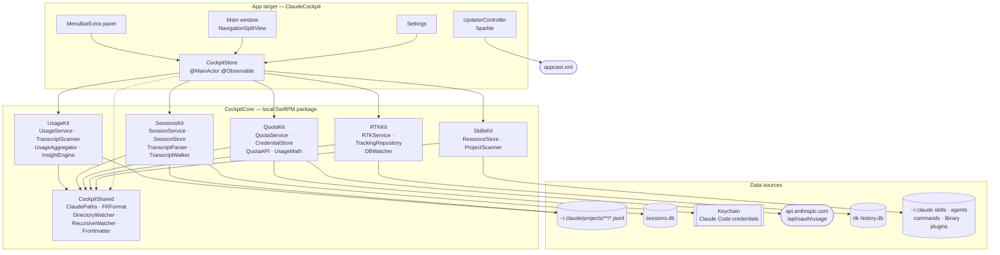

# ARCHITECTURE — Claude Cockpit

Source of truth for how the app is put together. The French mirror is
[`ARCHITECTURE.md`](ARCHITECTURE.md); both are edited in the same pass. The design decisions
behind these choices live in
[`docs/superpowers/specs/2026-09-21-claude-cockpit-design.md`](docs/superpowers/specs/2026-09-21-claude-cockpit-design.md).

## Overview

Claude Cockpit is a native macOS app (Swift 5.9, SwiftUI over an AppKit shell, macOS 14+) that
reads five independent sources and presents them in one place: Anthropic's quota gauges, Claude
Code's local transcripts — read live for local usage and indexed into a local database for the
Sessions section — rtk's savings database, and the skills / agents / commands tree.

The split that governs everything else is **logic in a package, UI in the app target**.
`CockpitCore` is a local SwiftPM package with no UI framework in sight: it builds and tests
without an `NSApplication`, which is what makes `swift test` fast and reliable. The app target
holds SwiftUI views, the AppKit shell, Sparkle, and a single hub object that owns the services.

Each kit exposes one **service** — an actor, or a `Sendable` class — that produces an immutable
**snapshot** struct. The app never opens a file, a socket or a database itself. That boundary is
the reason a failure in one source cannot take down another: the store catches it, stores it as
a state, and the corresponding section renders a banner while the rest keeps working.

## Component diagram

An interactive version of this diagram (pan, zoom, search, guided views, source references verified against the repository) is published at [https://vincentlauriat.github.io/ClaudeCockpit/diagrams/claude-cockpit-architecture.html](https://vincentlauriat.github.io/ClaudeCockpit/diagrams/claude-cockpit-architecture.html). Its source is `docs/diagrams/claude-cockpit.architecture.json`.

## Modules

| Module | Responsibility | Key types | Depends on |
|---|---|---|---|
| `CockpitShared` | Everything the other kits agree on: where files live, how numbers are written in French, how to watch a directory, how to parse front matter | `ClaudePaths`, `FRFormat`, `DirectoryWatcher`, `Frontmatter` | Foundation |
| `UsageKit` | Turns Claude Code's transcripts into every figure the usage screens show | `UsageService`, `TranscriptScanner`, `UsageAggregator`, `UsageSnapshot`, `UsageEvent`, `PricingSettings`, `InsightEngine`, `SessionSummary`, `BreakdownDimension` | `CockpitShared` |
| `SessionsKit` | Indexes Claude Code's transcripts into a local SQLite/FTS5 database and answers every question the Sessions section asks of it: listing, paging a transcript, full-text search, activity, recent edits, health | `SessionService`, `SessionStore`, `TranscriptParser`, `TranscriptWalker`, `SessionHealthRule`, `SessionExporter`, `SessionRef`, `SessionMessage`, `ContentBlock`, `SessionFilter`, `ActivityReport` | `CockpitShared`, SQLite.swift |
| `QuotaKit` | Reads the OAuth token, calls Anthropic's gauge endpoint, enforces the rate-limit policy, projects the pace | `QuotaService`, `CredentialStore`, `QuotaAPI`, `Meter`, `GaugeSnapshot`, `PaceProjection`, `UsageMath`, `PaceSentence` | `CockpitShared` |
| `RTKKit` | Read-only access to rtk's SQLite database, plus a watcher that fires when rtk writes | `RTKService`, `TrackingRepository`, `DBWatcher`, `RTKSnapshot`, `CommandRecord`, `TotalsStat`, `DayStat`, `CommandStat` | `CockpitShared`, SQLite.swift |
| `SkillsKit` | The three-level resource tree, its inventory, and every mutation with its backup | `ResourceStore`, `ProjectScanner`, `ClaudeResource`, `PluginResource`, `SkillsInventory`, `ResourceKind`, `ResourceLevel`, `SkillsError` | `CockpitShared` |
| App target | SwiftUI views, the AppKit shell, Sparkle, and the hub that owns the services | `CockpitStore`, `SettingsKey`, `AppDelegate`, `UpdaterController`, `CockpitSection`, `SourceState` | all of the above, Sparkle |

`ClaudePaths` deserves a note: every path in the app is computed from a `home` URL held by that
struct, and `CLAUDE_CONFIG_DIR` is applied in `ClaudePaths.live`. Pointing the whole app at a
temporary directory is therefore one initializer away, which is how the test suites run against
fixture trees without touching the real `~/.claude`.

## Data flow, per source

### Usage — local transcripts

Claude Code appends one JSONL transcript per session under
`~/.claude/projects/<encoded cwd>/<session>.jsonl`, plus one per sub-agent under
`…/subagents/agent-*.jsonl`. `TranscriptScanner` walks that tree and keeps, for each file, its
modification date and how many bytes it has already read, so a refresh only parses what was
appended since. Lines of type `assistant` carrying a `message.usage` object become `UsageEvent`s;
assistant messages that appear in both a session transcript and a sub-agent one are deduped on
`message.id`. Session titles come from standalone `ai-title` lines and `slug` fields, collected
in the same pass.

`UsageService` owns the scanner and the resulting event list. Aggregation is deliberately
separate: `UsageAggregator.snapshot(events:filters:pricing:now:)` is a pure function, so changing
a filter or a price recomputes the screen without re-reading a single byte from disk.

**Cadence:** every 30 seconds by default, never faster than 10. The scan runs off the main
thread; the snapshot lands on the main actor.

### Quota — Anthropic's gauge

`CredentialStore` reads the OAuth access token from the keychain item `Claude Code-credentials`
through `/usr/bin/security`, which is the same tool Claude Code uses to write it, so no extra
authorization prompt appears. If that fails it falls back to `~/.claude/.credentials.json`. Both
shapes are accepted, wrapped in `claudeAiOauth` or bare, and an expired token is reported as
such rather than sent. The token is never persisted or logged by the app.

`QuotaAPI` issues one `GET https://api.anthropic.com/api/oauth/usage` and parses the meters into
a `GaugeSnapshot`: the five-hour session meter, the seven-day meter, one meter per model
family (`seven_day_<model>` keys only), and, in `other`, the undocumented buckets the endpoint
also reports (`nimbus_quill`, …) so the UI can show them without presenting them as models. `UsageMath.projection(for:now:)` turns a meter into a `PaceProjection` — where the
current rate lands at reset, the rate you are running at, the rate that would land exactly on
100, and the even daily share of what is left.

**Cadence and backoff.** The endpoint is rate-limited hard, so `QuotaService` is strict about it:

| Rule | Value | Applies to |
|---|---|---|
| Minimum spacing between reads | 3 min | Automatic refreshes |
| Backoff after a 429 | 15 min | Everything, including the refresh button |
| Floor on a forced refresh | 10 s | The refresh button, against double taps |
| Concurrent callers | Coalesced onto the single in-flight read | Everything |

A refused call returns the cached snapshot when there is one, and only throws
`QuotaError.throttled(until:)` when nothing has ever been read. A failure never clears
`lastSnapshot`: the panel keeps the last known figures with their timestamp.

### RTK — the savings database

`TrackingRepository` resolves the database at `~/Library/Application Support/rtk/history.db`,
then `~/.local/share/rtk/history.db`, unless the user set an explicit path. It validates the
schema before trusting it, and opens a fresh read-only connection per query rather than holding
one open against a database another process is writing. `RTKService.snapshot()` reads today's
totals, the seven-day series, the all-time totals, the top commands and the recent trace in a
single pass and returns one `RTKSnapshot`.

Savings rates are volume-weighted (`SUM(saved) / SUM(input)`), not an average of per-command
percentages, which would let a handful of tiny commands dominate the figure.

**Cadence:** `DBWatcher` combines a kernel-event watch on the directory holding the database
with a polling fallback, debounced, and emits an `AsyncStream<Void>`. The store refreshes on
every tick, plus a 60-second poll that covers the case where no database existed at launch.

### Skills — the resource tree

`ProjectScanner` walks the configured roots — `~/DevApps` and `~/Documents/GitHub` by default —
at most three levels deep, skipping hidden directories and build caches, and stops descending
once a directory is recognized as a project. A project is any directory owning a `.claude/`.

`ResourceStore.inventory(projects:)` then reads three levels: Library
(`~/.claude/skillmanager/library`), Global (`~/.claude`), and one level per discovered project.
Skills are directories holding a `SKILL.md`; agents and commands are single `.md` files. Front
matter gives each one its name and description. The plugin cache is read separately, read-only.

Mutations — `transfer`, `importPlugin`, `delete` — all follow the same rule: validate that both
ends are inside the user's home directory, copy the affected files into
`~/.claude/backups/<yyyyMMdd-HHmmss>/<level>/<kind>/…`, then act. The backup path comes back to
the caller, and the UI shows it in the confirmation. Names are sanitized before becoming file
names.

**Cadence:** a `DirectoryWatcher` over the six global and library directories, plus a manual
refresh. Mutations refresh the inventory themselves.

### Sessions — the indexed transcript archive

Sessions reads the same tree `UsageKit` reads — `~/.claude/projects/<encoded cwd>/<session>.jsonl`
plus `…/subagents/agent-*.jsonl` — but for a different purpose: not aggregate figures, a
browsable, searchable transcript archive. `TranscriptWalker` walks the tree incrementally,
resuming each file from the byte offset reached last time, exactly like `UsageKit`'s scanner.
`TranscriptParser` turns each appended line into a typed `ParsedLine`, and `SessionStore` upserts
the result into `sessions.db`, a SQLite database at
`~/Library/Application Support/ClaudeCockpit/sessions.db` with an FTS5 virtual table for search.

**The index stores references, not the archive.** Copying every message and tool body into the
database would multiply the corpus rather than index it, so the `blocks` table holds
`(file_id, byte_offset, byte_len)` and the display text is read back from the transcript on
demand — transcripts are append-only, so an offset stays valid forever. Only a short
`text_preview` per message is denormalised for the list. FTS5 is fed selectively: user and
assistant text, thinking, tool inputs, and the first few kilobytes of each tool output.
Attachment bodies are never stored, only counted into `attachmentCount`, because they carry
entire injected skills and are the single most frequent line type in the corpus.

Sub-agent transcripts carry their **parent's** `sessionId` in every line, so they are indexed as
sessions of their own, keyed by the sub-agent's `agentId`, with `parentSessionId` pointing back
at the session that spawned them. `SessionFilter.includeSubagents` keeps them out of the main
list by default. On Vincent's archive of 987 indexed sessions (986 transcript files, 912 MB
read), 96.5 % of sub-agent transcripts were linked back to the exact `Agent` tool call that
spawned them; the rest still index and list, just without that specific cross-reference.

`SessionHealthRule` grades a session A–F from counters the indexer already maintains — tool
error ratio, API errors, aborted or interrupted turns, repeated identical tool failures, a
session that ended on an error — so computing a grade never re-reads a transcript.
`SessionExporter` renders one session, sub-agent transcripts inlined, to Markdown or
self-contained HTML.

**Cadence and live follow.** Indexing runs on its own timer, staggered against `UsageKit`'s 30 s
scan so the two do not walk the same archive on the same tick; a full index of the archive above
takes about 20 s, an incremental pass with nothing new to read about 0.16 s, and the resulting
database is about 206 MB. `CockpitStore` also arms a `RecursiveWatcher` — the shared,
FSEvents-backed recursive watcher in `CockpitShared`, generalised from `RTKKit/DBWatcher.swift` —
on `~/.claude/projects`, because a non-recursive `DirectoryWatcher` does not see a line appended
to a file several directories down. A debounced file-system event triggers an incremental index
pass, and the Sessions store publishes the change so an open session auto-appends and the list
shows a "live" badge.

**Mutations are index-only.** Starring, renaming and hiding a session write to `sessions.db`
alone; the transcript on disk is never touched. Hiding sets `deleted_at` and the row drops out of
every listing until the next full rebuild, which is also the only way to recover from a
corrupted database — `index(full: true)` drops and rebuilds it, carrying stars, custom names and
hidden sessions forward since they live nowhere else.

## Concurrency model

The rule is one-directional: **services do the work off the main actor, the store publishes the
result on it.**

| Type | Isolation | Why |
|---|---|---|
| `CockpitStore` | `@MainActor @Observable` | Everything SwiftUI observes lives here and nowhere else |
| `UsageService`, `TranscriptScanner` | `actor` | Serializes scans and protects the incremental cache |
| `SessionService` | `actor` | Serializes indexing passes and every read/write against `sessions.db`, exactly like `UsageService` serializes scans |
| `QuotaService` | `actor` | Serializes network reads and owns the rate-limit state |
| `ResourceStore` | `actor` | Serializes filesystem mutations so two transfers cannot interleave |
| `TrackingRepository` | `Sendable` struct | Holds no state beyond the database URL; each query opens its own connection |
| `RTKService` | `@unchecked Sendable` final class | Owns the watcher; the store calls its snapshot from a detached task |
| `DirectoryWatcher`, `DBWatcher` | `@unchecked Sendable` | DispatchSource-backed, publish through `AsyncStream<Void>` |
| `RecursiveWatcher` | `@unchecked Sendable` | FSEvents-backed, recursive; `CockpitStore` arms it on `~/.claude/projects` for the Sessions live follow |
| Snapshots (`UsageSnapshot`, `GaugeSnapshot`, `RTKSnapshot`, `SkillsInventory`, `SessionRef`, `ActivityReport`) | immutable `Sendable` | Cross the actor boundary without copying concerns |

`CockpitStore.start()` launches the refresh loops once and keeps their `Task` handles. There are
six: usage on its interval, sessions on its own staggered interval plus the `RecursiveWatcher`
stream for live follow, quota on a three-minute interval, rtk on the watcher stream, a slower rtk
fallback poll, and skills on the directory watcher. They are structured as
`while !Task.isCancelled { await refresh…(); try? await Task.sleep(…) }` rather than as
`Timer`s, which sidesteps the run-loop-mode trap that bites menu-bar apps (see Gotchas).

The heavy synchronous work — scanning the project tree, reading the SQLite snapshot — is pushed
onto `Task.detached(priority: .utility)` so it never occupies the main actor.

## Persistence

Nothing about the user's data is cached beyond the scan index. What persists is preferences and
the incremental scan state.

### UserDefaults

| Key | Type | Default | Meaning |
|---|---|---|---|
| `settings.launchAtLogin` | Bool | off | Mirrors the `SMAppService` registration |
| `settings.menuBarOnly` | Bool | off | Activation policy: `.accessory` when on, `.regular` when off |
| `settings.usageRefreshSeconds` | Int | 30 | Usage loop interval, floored at 10 |
| `settings.rtkDBPath` | String | empty | Explicit rtk database path; empty means auto-resolve |
| `settings.projectRoots` | String | empty | Newline-separated roots; empty means the defaults |
| `settings.pricingJSON` | String | — | The four model-family rates, serialized |
| `settings.currency` | String | `USD` | Display currency |
| `settings.eurRate` | Double | 0.92 | USD to EUR conversion used when the currency is EUR |
| `settings.sessionsIndexEnabled` | Bool | on | Whether transcripts are indexed for the Sessions section |
| `sessions.showSystemLines` | Bool | off | "Afficher les lignes système" toggle in the transcript view |
| `sessions.grouping` | String | `day` | Session list grouping: `day` or `project` |
| `sessions.selectedId` | String | — | Last opened session |
| `sessions.tab` | String | `browser` | Last selected Sessions tab: browser, activity or edits |
| `panel.section.limits` | Bool | true | Panel section collapse state |
| `panel.section.today` | Bool | true | Panel section collapse state |
| `panel.section.savings` | Bool | true | Panel section collapse state |
| `window.section` | String | — | Last selected sidebar item |

Defaults are registered in `SettingsKey.registerDefaults()`, called from the store's
initializer, so a fresh install and an upgraded one read the same values.

### Files the app writes

| Path | Content | Lifetime |
|---|---|---|
| `~/Library/Application Support/ClaudeCockpit/scan-cache.json` | Per-file `(mtime, bytesRead)` plus collected session metadata | Rewritten only when a scan actually read new bytes; cleared by a full rescan |
| `~/Library/Application Support/ClaudeCockpit/sessions.db` (+ `-wal`/`-shm`) | The Sessions index: `sessions`, `messages`, `blocks` (byte offsets, not bodies), `edits`, `subagents`, `pr_links`, and an FTS5 table. About 206 MB for Vincent's 912 MB archive | Updated incrementally by byte offset on every index pass; "Reconstruire l'index" drops and rebuilds it, stars, names and hidden flags carried over |
| `~/.claude/backups/<yyyyMMdd-HHmmss>/<level>/<kind>/…` | A copy of everything a mutation is about to touch | Never pruned by the app — deleting old backups is the user's call |

The app writes nowhere else. Transcripts, credentials and rtk's database are read-only, always.

## Error handling

The policy is one sentence: **every source fails alone, and a failure never destroys what was
already known.**

`SourceState` is `idle`, `loading`, `ready(Date)` or `failed(String)`, one per source. The store
sets `loading` only when there is no snapshot yet, so a refresh that fails behind a populated
screen leaves the figures in place and adds a banner rather than blanking the section.

| Situation | What the user sees |
|---|---|
| No OAuth token | The quota section explains how to sign in with Claude Code |
| Expired token | Named as expired, not as a generic network failure |
| Network error on the gauge | The last snapshot stays, labelled with the time it was fetched |
| 429 from Anthropic | Same, plus the moment the next read is allowed |
| Throttled refresh with a cached snapshot | Nothing: the cached snapshot is returned, not an error |
| No rtk database | The RTK section shows an install hint |
| Unexpected rtk schema | The section reports it instead of returning wrong numbers |
| Transfer destination exists | `SkillsError.alreadyExists` with the path, and a chance to overwrite |
| Path outside `$HOME` | `SkillsError.outsideHome`, refused before anything is touched |

Skills mutations are all-or-nothing per operation, and the backup path is surfaced in the
confirmation toast so an unwanted move is one Finder trip from being undone.

## Testing

Tests live in `CockpitCore/Tests/<Kit>Tests/` and run with `swift test`. There are no UI tests
and no `NSApplication` anywhere in the suite, which is what keeps the whole run cheap enough to
be worth doing on every change.

| Suite | Covers |
|---|---|
| `CockpitSharedTests` | Path derivation including `CLAUDE_CONFIG_DIR`, French formatting, front-matter parsing |
| `UsageKitTests` | Transcript scanning against JSONL fixtures, incremental re-reads, deduplication, pricing math, date-range bounds, aggregation |
| `SessionsKitTests` | Transcript line parsing for every line kind, incremental indexing and resume, deduplication, store queries (list filters, FTS snippets, recent edits, activity buckets), health grading, exporters, and a benchmark against the full real corpus |
| `QuotaKitTests` | Credential parsing for both JSON shapes and expiry, gauge parsing, pace math, and the rate-limit policy driven by an injected clock |
| `RTKKitTests` | Repository queries against a fixture `history.db` built in a temp directory, schema validation, watcher ticks |
| `SkillsKitTests` | Inventory over a temp `HOME`, transfer and import, backup creation, refusal of paths outside home |

The testability comes from two deliberate choices made in the design: every path flows from an
injectable `ClaudePaths`, and every dependency that touches the outside world sits behind a
protocol (`TokenProviding`, `QuotaFetching`) or takes an injected clock.

## Release pipeline

`Scripts/release.sh <version>` runs the whole thing:

1. `xcodegen generate`, then `xcodebuild -configuration Release` with `CODE_SIGNING_ALLOWED=NO`.
   The build number is the git commit count.
2. Stage through `ditto --norsrc --noextattr --noacl` into a clean temp directory.
3. Codesign with Hardened Runtime and a secure timestamp, deepest first: Sparkle's `Autoupdate`,
   `Downloader.xpc`, `Installer.xpc`, `Updater.app`, then the framework, then the app. Each
   signature is retried up to five times, because Apple's timestamp server is flaky.
4. Build the DMG with a Finder icon-view layout, background image and `/Applications` alias,
   into `release/`.
5. Notarize with the shared keychain profile `AppliMacVincentGithub`, then staple and validate.
6. EdDSA-sign the DMG with `sign_update --account ClaudeCockpit` and write `appcast.xml`.
7. Print the `gh release create` command.

The feed is served from
`https://raw.githubusercontent.com/vincentlauriat/ClaudeCockpit/main/appcast.xml`, declared as
`SUFeedURL` in `project.yml` alongside `SUPublicEDKey`. Publish the GitHub release before
pushing the feed: the enclosure URL points at the release asset, and a feed that goes live first
hands every client a 404.

## Gotchas

These are the ones that cost real time, in this project or in its ancestors. They are written
down because none of them announce themselves.

**Never regenerate the Sparkle key.** The private half lives in the login keychain under the
account `ClaudeCockpit`, backed up at
`~/Documents/SparkleKeys/ClaudeCockpit-sparkle-private-key.txt`. Its public half is baked into
every shipped copy as `SUPublicEDKey`. Running `generate_keys` again for that account, or
editing that value, makes every installed copy reject every future update, permanently. There
is no recovery short of asking users to reinstall by hand.

**`sparkle:version` is `CFBundleVersion`, not the marketing version.** Sparkle compares that
element against the running app's `CFBundleVersion`, which is an integer here. Writing `1.0.0`
into it makes the comparator read `1.0.0` against `1`, conclude the user is up to date, and
never offer the update. The marketing version belongs in `sparkle:shortVersionString` only.

**Codesign after `ditto --noextattr`, never in place.** A Release build carries
`com.apple.provenance` extended attributes that make `codesign --force` fail on recent macOS.
Hence `CODE_SIGNING_ALLOWED=NO` at build time and a manual signing pass over a staged copy.

**A `MenuBarExtra(.window)` panel has no natural height.** A `ScrollView` inside it collapses to
nothing unless the content is given an explicit frame, because the panel sizes itself to its
content and the scroll view is happy to be zero tall. Pin a height, or a range, on the panel's
root.

**Timers in a menu-bar app need `.common` run-loop mode.** A `Timer` scheduled in the default
mode stops firing while a menu or a popover is open — exactly when the panel is on screen. This
is why the refresh loops are `Task` loops with `Task.sleep` rather than timers.

**Sparkle dialogs need a Dock icon.** In menu-bar-only mode the app runs as `.accessory`, and
Sparkle's windows open behind everything with no way to bring them forward.
`UpdaterController` raises the activation policy to `.regular` for the duration of an update
session and lowers it back afterwards, but only when it was the one that raised it.

**One SQLite connection per query, read-only.** rtk writes to `history.db` while the app reads
it. Holding a long-lived connection invites lock contention and stale WAL reads; opening per
query costs microseconds and avoids both.

**Identifiable ids in Swift Charts must be stable.** An `id` computed as `UUID()` randomizes on
every access, so Charts sees an entirely new dataset on each redraw and rebuilds every mark.
Derive the id from the data instead.
