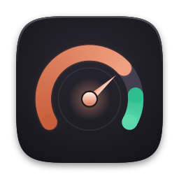
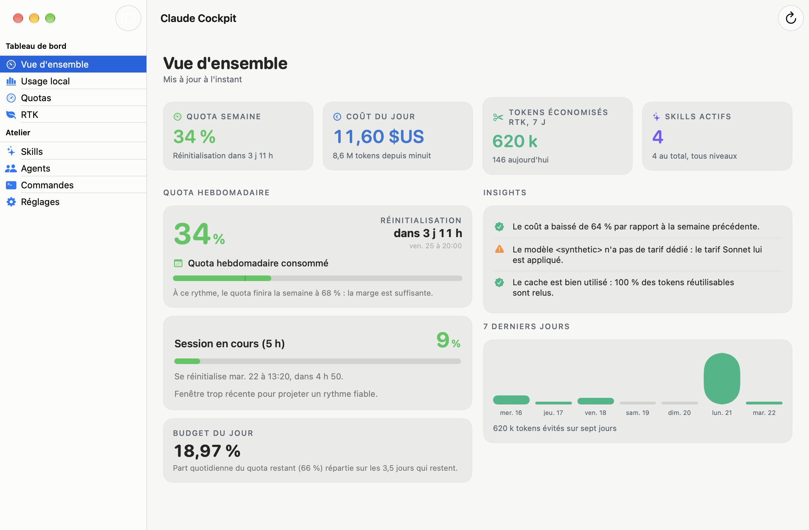
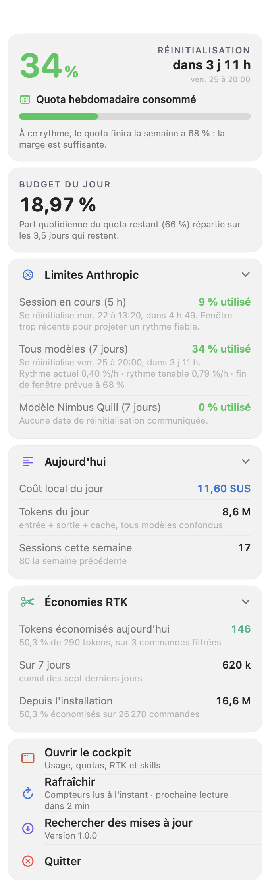
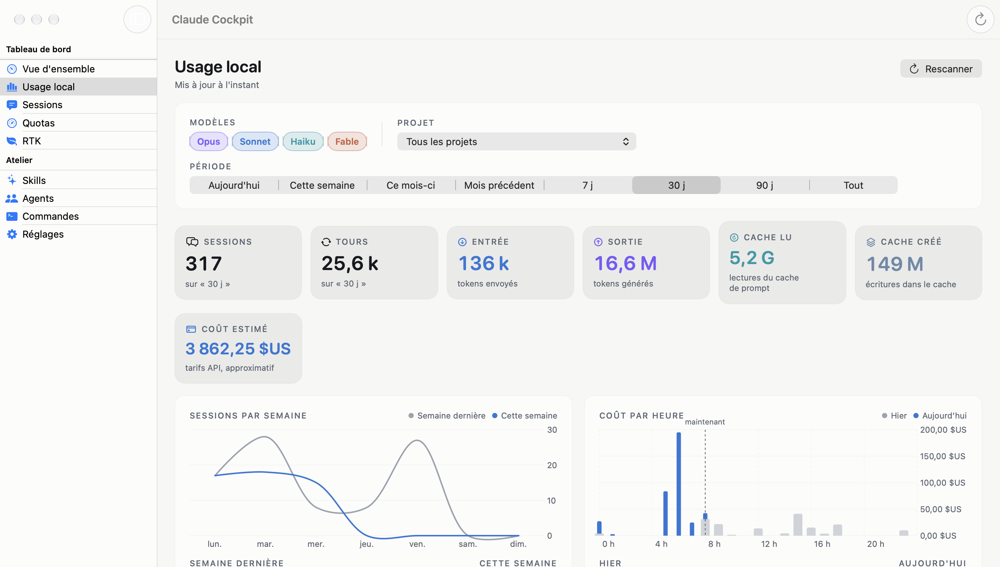
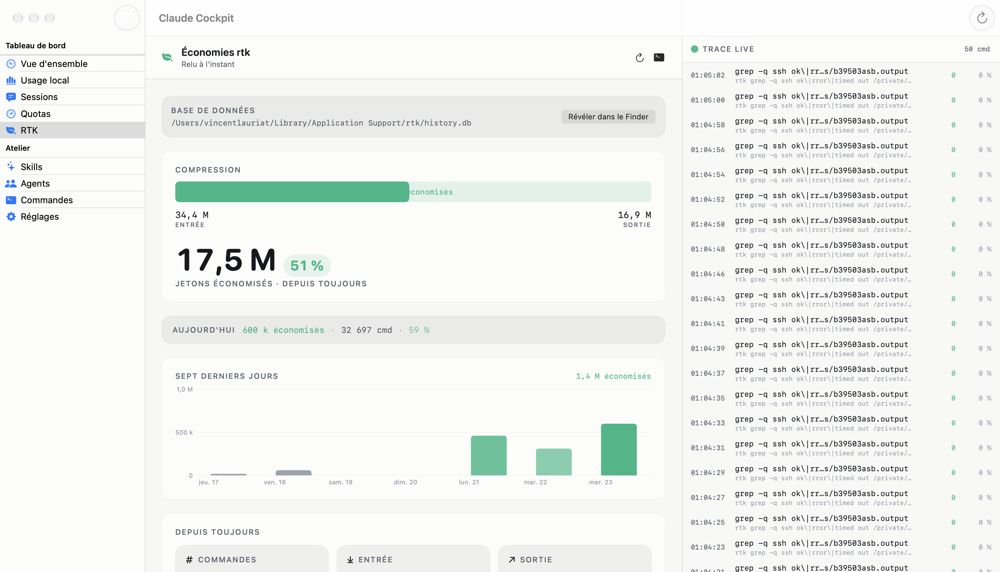
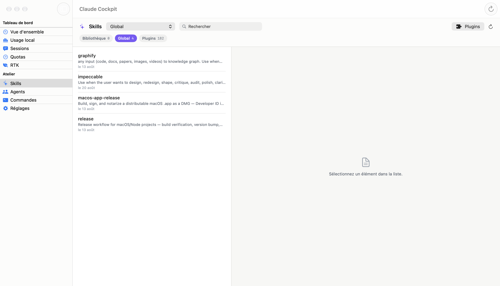
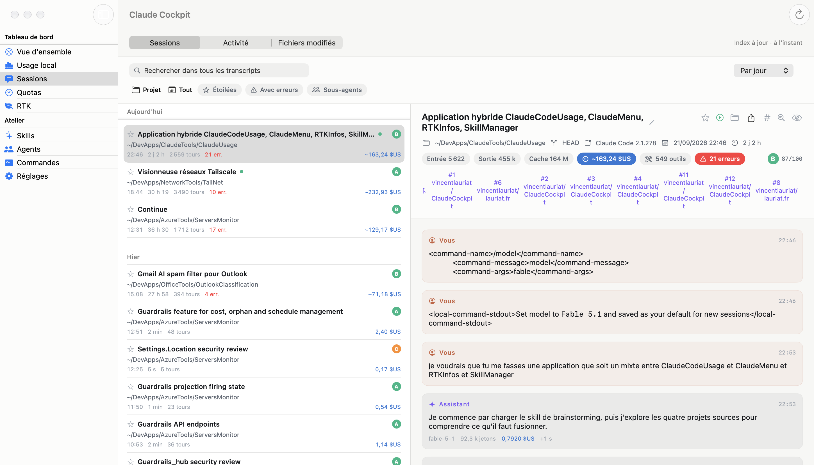
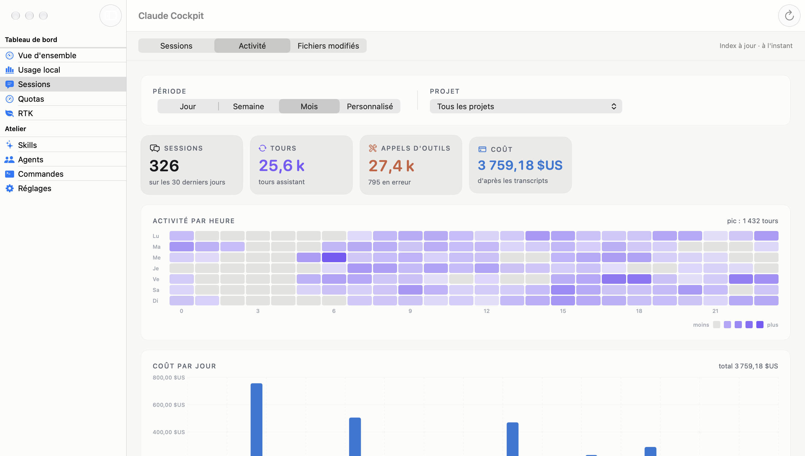
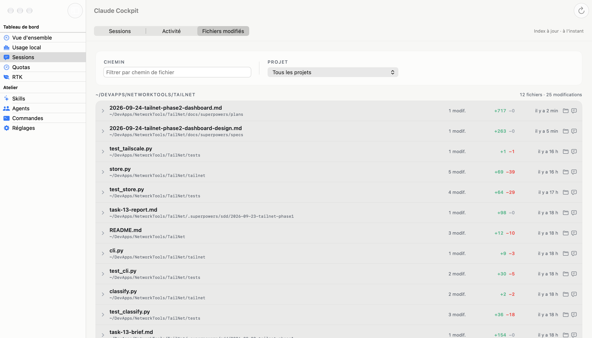

<div align="center">



# Claude Cockpit

**One native macOS app for everything around Claude Code: your Anthropic quotas and pace, your local usage and cost, your RTK token savings, and your skills, agents and commands.**

[](https://github.com/vincentlauriat/ClaudeCockpit/releases/latest)
[](https://www.apple.com/macos/)
[](https://swift.org)
[](LICENSE)
[](#install)

[Download the latest release](https://github.com/vincentlauriat/ClaudeCockpit/releases/latest) ·
[Landing page](https://vincentlauriat.github.io/ClaudeCockpit/) ·
[Architecture](ARCHITECTURE_EN.md) ·
[Interactive diagram](https://vincentlauriat.github.io/ClaudeCockpit/diagrams/claude-cockpit-architecture.html) ·
[Contributing](CONTRIBUTING.md)



</div>

---

## What it is

Claude Cockpit merges four separate tools into a single native app:

| Merged tool | What it brought |
|---|---|
| [ClaudeCodeUsage](https://github.com/vincentlauriat/ClaudeCodeUsage) | Local usage dashboard built from Claude Code's JSONL transcripts — tokens, estimated cost, daily chart, editable pricing |
| [ClaudeMenu](https://github.com/vincentlauriat/ClaudeMenu) | Menu-bar panel with Anthropic Pro/Max quotas, pace projection and daily budget |
| [RTKInfos](https://github.com/vincentlauriat/RTKInfos) | Token savings read from [rtk](https://github.com/rtk-ai/rtk)'s SQLite history database |
| [SkillManager](https://github.com/vincentlauriat/SkillManager) | Skills, agents and commands across three levels, with transfer between them |

The form factor is **hybrid**. A menu-bar item shows your weekly quota percentage at a
glance and opens a compact panel; a full window holds the detailed dashboards. You can run
it as a menu-bar-only app with no Dock icon, or as a regular windowed app.

Everything is read locally from your own machine. The only network call the app ever makes
is to Anthropic's own quota endpoint, with the token Claude Code already stored for you.

## Features

### Quotas & pace

| What you see | Detail |
|---|---|
| Weekly and session gauges | The same meters Claude Code's `/usage` reports, read from Anthropic's OAuth usage endpoint |
| Per-model meters | One meter per model family on the seven-day window, with its own reset countdown |
| Pace projection | Where the current burn rate lands at reset, the rate you are running at, and the rate that would land exactly on 100 % |
| Daily budget | What an even share of the remaining quota gives you per day until reset |
| Menu-bar label | Weekly utilization as a percentage, always visible |
| Rate-limit discipline | Reads are never closer than 3 minutes; a 429 backs off for 15 minutes; the last known figures stay on screen with their timestamp |

### Local usage & cost

| What you see | Detail |
|---|---|
| Stat grid | Sessions, turns, input, output, cache read and cache creation tokens, estimated cost |
| Daily chart | Stacked per-day token series over the selected range |
| Filters | By model family, by project (working directory) and by date range, from Today to All |
| Breakdown table | Cost and tokens grouped by project, by agent or by skill, sorted by cost |
| Sessions list | Named sessions, most recent first, with a per-session detail pane |
| Insights | Automatic signals: week-over-week cost swings, models with no dedicated pricing tier, cache hit rate |
| Editable pricing | The four per-model-family rates are yours to correct when Anthropic changes prices |
| Incremental scanning | Only bytes appended since the last pass are read, and the cache survives relaunches |

### RTK savings

| What you see | Detail |
|---|---|
| Compression gauge | Raw input compressed to output, with the reclaimed tokens highlighted |
| Today strip | Commands filtered, tokens saved and savings rate for the current day |
| Seven-day chart | Daily tokens saved over the last week |
| All-time tiles | Command count and cumulative tokens saved since rtk was installed |
| By command | Top commands ranked by tokens saved, with their own savings rate |
| Live trace | The most recent commands rtk filtered, newest first |
| Live updates | The database is watched, so the figures move as you work |

### Skills, agents & commands

| What you see | Detail |
|---|---|
| Three levels | Library (inactive), Global (`~/.claude`) and Project (any project owning a `.claude/` directory) |
| Searchable inventory | Every skill, agent and command with its name, description and modification date |
| Rendered detail | The Markdown body of the selected resource, front matter parsed out |
| Copy & move | Transfer a resource between levels, with a backup written first |
| Plugin import | Pull a skill out of the plugin cache into Library, Global or a project |
| Reveal & delete | Open the file in the Finder, or delete it (the copy in the backup folder is kept) |
| Project discovery | Configured roots are scanned up to three levels deep for `.claude/` directories |

### Sessions

| What you see | Detail |
|---|---|
| Session browser | Every transcript under `~/.claude/projects`, full-text searchable (SQLite FTS5) across message text and tool input and output |
| Filters & grouping | By project, date range, starred, with errors, and sub-agents shown or hidden; grouped by day or by project |
| Full transcript | User and assistant turns, collapsible tool calls with their input and output, coloured diffs for file edits, thinking blocks, sub-agent transcripts expanded inline, compaction dividers |
| Per-turn detail | Model, tokens and cost on every turn, an in-session find bar, and a health grade with its evidence |
| Actions | Star, rename, hide, reveal the transcript in the Finder, export to Markdown or HTML, resume in the Terminal with `claude --resume` |
| Activité tab | Hour-by-weekday heatmap, cost per day, tool mix with error rates, model mix |
| Fichiers modifiés tab | Files edited across sessions, grouped by project and path, newest first |
| Local index | An incremental SQLite index kept in Application Support, rebuilt from the transcripts on demand; nothing about a session ever leaves the machine |

## Gallery

| | |
|---|---|
|  |  |
| The menu-bar panel | Local usage and cost |
|  |  |
| RTK token savings | Skills, agents and commands |
|  |  |
| The session browser and transcript detail | The Activité tab: heatmap, cost per day, tool and model mix |
|  | |
| The Fichiers modifiés tab | |

## Install

1. Download the latest `.dmg` from
   [Releases](https://github.com/vincentlauriat/ClaudeCockpit/releases/latest).
2. Mount it and drag **ClaudeCockpit.app** into `/Applications`.
3. Launch it. The app is signed with a Developer ID certificate and notarized by Apple, so
   Gatekeeper opens it without a detour through System Settings.

Once installed it keeps itself current: Sparkle checks the release feed daily and offers
updates rather than installing them behind your back. You can also trigger a check from
**Claude Cockpit ▸ Rechercher des mises à jour…**.

Two things are worth setting on first launch, both in **Réglages**:

- **Menu bar only** hides the Dock icon and runs the app as a background agent. The main
  window is still one click away from the panel.
- **Launch at login** registers the app with macOS. The app must live in `/Applications`
  for this to work.

Quotas need a Claude Code session that is already signed in: the app reads the OAuth token
Claude Code stored, it never asks you for credentials. Run `claude` and log in once, and the
quota section fills in on the next refresh. The other three sections need nothing.

**Requirements:** macOS 14 Sonoma or later. Claude Code installed and used at least once for
the usage and quota sections; [rtk](https://github.com/rtk-ai/rtk) installed for the savings
section. Each section degrades on its own: a missing rtk database shows an install hint, not
an error dialog.

## Data sources & privacy

| Source | Path | Access | Network |
|---|---|---|---|
| Claude Code transcripts | `~/.claude/projects/**/*.jsonl` | Read-only | None |
| OAuth access token | Keychain item `Claude Code-credentials`, else `~/.claude/.credentials.json` | Read-only, kept in memory only | Sent as a bearer token to `https://api.anthropic.com/api/oauth/usage`, nowhere else |
| rtk history | `~/Library/Application Support/rtk/history.db`, else `~/.local/share/rtk/history.db` | Read-only, one connection per query | None |
| Skills, agents, commands | `~/.claude/{skills,agents,commands}`, `~/.claude/skillmanager/library`, and each project's `.claude/` | Read, plus writes on an explicit transfer, import or delete | None |
| Plugin cache | `~/.claude/plugins/cache/<org>/<plugin>/<version>/skills` | Read-only | None |
| Backups | `~/.claude/backups/<timestamp>/` | Written before every mutation | None |
| Scan cache | `~/Library/Application Support/ClaudeCockpit/scan-cache.json` | Read and written by the app | None |
| Session index | `~/Library/Application Support/ClaudeCockpit/sessions.db` | Read and written by the app, built by reading transcripts incrementally | None |

A few consequences worth stating plainly:

- **No telemetry, no analytics, no crash reporting.** Nothing about you leaves the machine.
- **Transcripts are also indexed into a local SQLite database.** The Sessions section reads
  `~/.claude/projects` the same way local usage does, then writes what it finds into `sessions.db`
  so search and analytics don't re-scan the whole archive on every open. Building and querying
  that index is still read-only with respect to `~/.claude` — no transcript is ever modified —
  and it makes no network call of its own.
- **The token is never persisted or logged by the app.** It is read at refresh time, used for
  one request, and dropped. The keychain read goes through `/usr/bin/security`, the same tool
  Claude Code itself uses, so no extra authorization prompt appears.
- **The skills domain is the only one that writes**, and only when you ask for a copy, a move,
  an import or a delete. Every one of those copies the affected files into
  `~/.claude/backups/` first, and the confirmation shows you the backup path.
- **Paths outside your home directory are refused.** Resource names are sanitized before they
  become file names.
- **`CLAUDE_CONFIG_DIR` is honoured.** If you point Claude Code at a directory other than
  `~/.claude`, the app follows it.
- **The app is not sandboxed.** It needs unprompted read access to `~/.claude` and to rtk's
  database, which the App Sandbox cannot grant.

## Build from source

```bash
brew install xcodegen          # if not already installed
git clone https://github.com/vincentlauriat/ClaudeCockpit.git
cd ClaudeCockpit
xcodegen generate
xcodebuild -project ClaudeCockpit.xcodeproj -scheme ClaudeCockpit \
           -configuration Debug CODE_SIGNING_ALLOWED=NO build
```

The core modules build and test on their own, with no `NSApplication` involved:

```bash
cd CockpitCore && swift test
```

`.xcodeproj` is not committed. `project.yml` is the source of truth, so regenerate the
project after each clone and after every edit to it.

**Requirements:** macOS 14+, Xcode 15+ (Swift 5.9), xcodegen. Dependencies resolve
automatically through SwiftPM: Sparkle 2.9.1+ for updates and SQLite.swift 0.16+ for reading
rtk's database.

## Project layout

```
ClaudeCockpit/
├── ClaudeCockpit/              app target — UI and the AppKit shell only
│   ├── App/                    CockpitApp, AppDelegate, UpdaterController
│   ├── Store/                  CockpitStore (@MainActor @Observable hub), Settings keys
│   ├── MenuBar/                the compact panel
│   ├── Window/                 main window, sidebar, one view per section
│   ├── Theme/                  design tokens and shared components
│   └── Resources/              Assets.xcassets, Info.plist, entitlements
├── CockpitCore/                local SwiftPM package — all the logic, no UI
│   ├── Sources/CockpitShared/  paths, French formatters, watchers, front matter
│   ├── Sources/UsageKit/       transcript scanner, pricing, aggregation, insights
│   ├── Sources/SessionsKit/    session index (SQLite/FTS5), transcript parser, health, export
│   ├── Sources/QuotaKit/       credentials, usage API, pace math, rate limiting
│   ├── Sources/RTKKit/         read-only SQLite repository and database watcher
│   ├── Sources/SkillsKit/      resource model, three-level store, transfers, backups
│   └── Tests/                  XCTest suites, one per module
├── Scripts/                    release.sh, make-app-icon.swift, make-dmg-background.swift
├── docs/                       landing page, screenshots, design spec
├── appcast.xml                 Sparkle release feed
└── README.md, ARCHITECTURE_EN.md, ARCHITECTURE.md, CONTRIBUTING.md, LICENSE
```

## Release

```bash
./Scripts/release.sh 1.0.1
```

The script regenerates the project, builds Release, stages the app through `ditto
--noextattr` and signs it by hand: Sparkle's nested helpers first, deepest first, then the
framework, then the app, all with Hardened Runtime and a secure timestamp. It packages a DMG
with a Finder layout into `release/`, notarizes it with the shared keychain profile, staples
the ticket, EdDSA-signs the DMG for Sparkle and rewrites `appcast.xml`. It finishes by
printing the `gh release create` command.

The feed lives at
`https://raw.githubusercontent.com/vincentlauriat/ClaudeCockpit/main/appcast.xml`. Publish
the GitHub release before pushing the feed, or Sparkle clients follow a URL that 404s.

## Lineage

Claude Cockpit is the successor to four apps, each of which keeps its own repository and
landing page:

| App | Repository | Landing page |
|---|---|---|
| ClaudeCodeUsage | [github](https://github.com/vincentlauriat/ClaudeCodeUsage) | [pages](https://vincentlauriat.github.io/ClaudeCodeUsage/) |
| ClaudeMenu | [github](https://github.com/vincentlauriat/ClaudeMenu) | [pages](https://vincentlauriat.github.io/ClaudeMenu/) |
| RTKInfos | [github](https://github.com/vincentlauriat/RTKInfos) | [pages](https://vincentlauriat.github.io/RTKInfos/) |
| SkillManager | [github](https://github.com/vincentlauriat/SkillManager) | [pages](https://vincentlauriat.github.io/SkillManager/) |

## Roadmap

- [x] Menu-bar panel with the weekly gauge, pace and daily budget
- [x] Local usage dashboard with filters, breakdown, sessions and editable pricing
- [x] RTK savings dashboard with live trace
- [x] Skills, agents and commands across three levels, with transfer and plugin import
- [x] Sessions section: full transcript browser and search, activity and edited-files
      analytics, export and resume
- [x] Menu-bar-only mode and launch at login
- [x] Signed, notarized DMG with Sparkle auto-update
- [ ] Hooks, MCP servers, `CLAUDE.md` and memory editing — full parity with SkillManager
- [ ] English UI alongside the French one
- [ ] An iOS companion for the quota gauges

## License

[MIT](LICENSE) — © 2026 Vincent Lauriat.

Built by Vincent Lauriat · [lauriat.fr](https://lauriat.fr) ·
[vincentlauriat.github.io](https://vincentlauriat.github.io)
